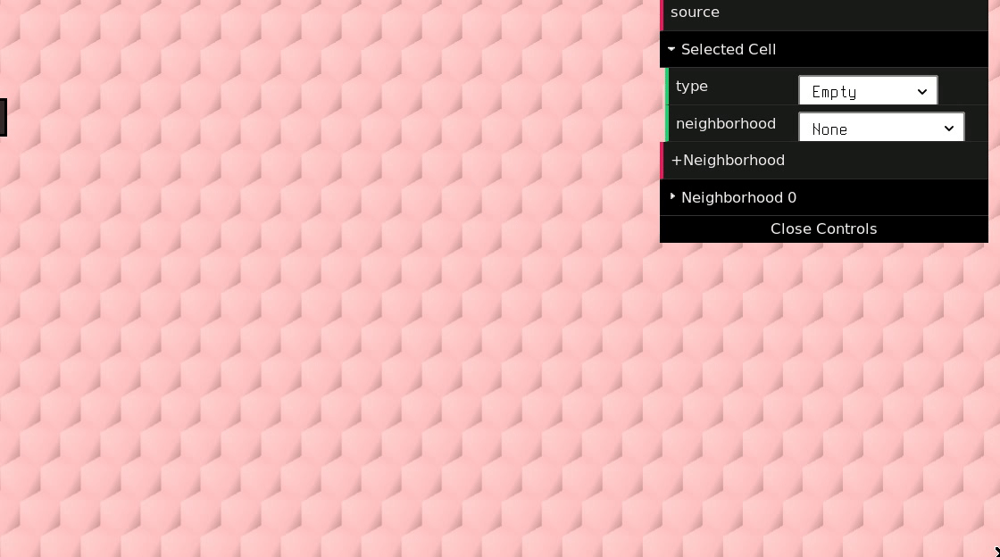

# doma.play

## Usage

- `npm start` to start the frontend and API server, hen go to `localhost:5000` for the city view.
- `python main.py` to run the simulation

## Designer

Visit `/design` to access the map designer.

Basic usage:

- Click to select a cell
- Shift+click to add to the selection
- Ctrl+shift & move mouse to paint selection
- Click `source` to get map data
    - You can paste in map data here to "load" an existing map

## Architecture

- Simulation process (Python)
    - Runs simulation
    - Reads commands from Redis
    - Outputs simulation state to Redis
- API server (Python)
    - Reads simulation state from Redis
    - Writes commands to Redis
    - Provides API for querying simulation state and executing actions in the simulation
    - Continues running in absence of players (i.e. persistent)
- Visualization client (JS, desktop)
    - Visualizes the simulation at the macro level (i.e. the cityscape)
- Player client (JS, mobile)
    - Visualizes the state of a single player-tenant
    - Provides interactivity for controlling the player-tenant

## Simulation

### Initialization

- Initialize $r \times c$ grid of parcel-buildings
- Initialize $q$ neighborhoods
- For each building $b$, initialize $n_b$ units, for a total of $n$ units
    - Each unit has a random rent per square foot $r_u$
- Initialize $m$ tenants, where $m < n$
    - Each tenant has a random income $i_t$
- Assign each tenant $t$ to a vacant unit $u^* = \text{argmax}_{\{u | o_u == 0\}} P_t(u)$, where $o_u$ is the occupancy of unit $u$ and $P_t(u)$ is the preference for unit $u$ of tenant $t$. Note that $P_t(u) = 0$ if $r_u a_u > i_t$, where $a_u$ is the area of unit $u$.
- Initialize $k$ landlord-developers
- Assign ownership of each unit $u$ to either:
    - a random landlord-developer $d$
    - its tenant $t_u$
    - a random tenant $t \neq t_u$

### Monthly loop

For each month $m$:

- For each landlord-developer $d$
    - __Update rent estimates__: For each unit $u_d$ owned by $d$, update estimated market rent $r_u^* := E_d(u)$, where $E_d$ is the rent estimation function for landlord-developer $d$
    - __Update neighborhood trend estimates__: For each neighborhood $B$, where $B$ is a set of units, fit a linear model of mean rents for the past $j$ months ($\bar r_{B,i} = r_u \forall \{u \in B; i \in j\}$) and get estimated rent for month $m+h_d$, where $h_d$ is the time horizon (in months) for developer $d$, estimated investment value $v_B$ of neighborhood $B$ is $r_{B,m_h+d} - \bar r_{B,m}$
    - __Update vacant rents__: for each vacant unit $u_d$ owned by $d$, update rent $r_u := V_d(u, m_u)$, where $V_d$ is the vacant rent update function for developer $d$ and $m_u$ is how many months $u$ has been vacant for. $V_d(u, m_u)$ should go down as $m_u$ goes up.
    - __Update occupied rents__: For each unit that is starting a new lease-year, update its rent $r_u := r_u^*$
    - __Make purchase offers__: Take the neighborhood with the greatest estimated investment value and get the units with the lowest rents. Submit a purchase offer $p_u = r_u * h_d$.
    - __Response to purchase offers__: For each received purchase offer $q_{u,i}$, accept highest purchase offer $q_{u,i}$ if $v_B * h_d < q_{u,i}$
- For each tenant $t$
    - If at the end of a lease-year, compute $P_t(u)$ for each of a sample of $n$ vacant units, and compute the preference difference $P^*_{t, u} = P_t(u) - P_t(u_t) - p_t$ where $u_t$ is the tenant's current residence and $p_t$ is a moving penalty for tenant $t$. If any $P^*_{t, u} > 0$, choose the maximum to move into.
    - If the tenant has no unit, compute $P_t(u)$ for all vacant units, and if any $P_t(u) > 0$, choose the maximum to move into.

### Possible enhancements

- Add in maintenance costs, which affect the attractiveness of a unit. Landlords decide how much to invest into maintenance, by estimating return for each dollar spend on maintenance (some maybe learn a linear model of appeal of unit $u$, $l_u$, relationship to $r_u$).
- Add in migration (people moving to/from the city)
- Demolition/construction of new buildings

# Tuning the model

You can run the simulation with:

    DEBUG=1 python main.py

Which will create a file called `history.json` upon quitting (`CTRL+C`) the simulation. You can then run `plot.py` to see plots for each of the collected stats.

---

# misc

- how do landlords device how much to invest in maintenance?
    - depending on risk of lease-breaking? if so, how is this risk computed? maybe based on availability of other units in the neighborhood at comparable price and below and comparable quality. look at mean vacancy of these units over the past year.
    - should really be expected return per dollar of maintenance expenditure. this takes into account mean vacancy (by way of expected rental income), and landlords learn a log-linear model for the marginal return (in % of rent) of an additional dollar of maintenance expenditure, based on data points from other units in the neighborhood
    - maintenance cost can be a scale of 0-1% of property value; maintenance level is a function of unit age and maintenance expenditure
- how to determine value horizon for owners? there may be conditions where the horizon becomes shorter, but how do those conditions occur? (and can we use NPV here as the formula?)
    - this could just change randomly for tenant-owners, based on a global `precarity` parameter

Net Present Value (NPV)/Discounted Cash Flow: a way of computing the present value of something, taking into account present & future income and cash outflows (e.g. investment)
1. compute present value of all cash inflows and outflows

Weighted Average Cost of Capital (WACC), e.g. interest on a loan
Present is $t=0$ and is usually negative b/c of investment, for every $t > 1$ estimate the expected cash inflow and divide that by $(1+WACC)^t$
You go out some number of years, e.g. 5, and then add these up.

Internal Rate of Return (IRR): the discount rate at which NPV becomes 0, i.e. set NPV to 0 and solve for WACC. The solution for WACC is the IRR.

landlords should make offers based on recent sale prices in that neighborhood for comparable homes, per sq m. then they calculate the NPV of their investment over 5 years, with a desired rate of return as the discount rate

---

Improvements: look at all TODOs, also, incomes don't change and they probably should; the population is also static, and that should probably change over time
